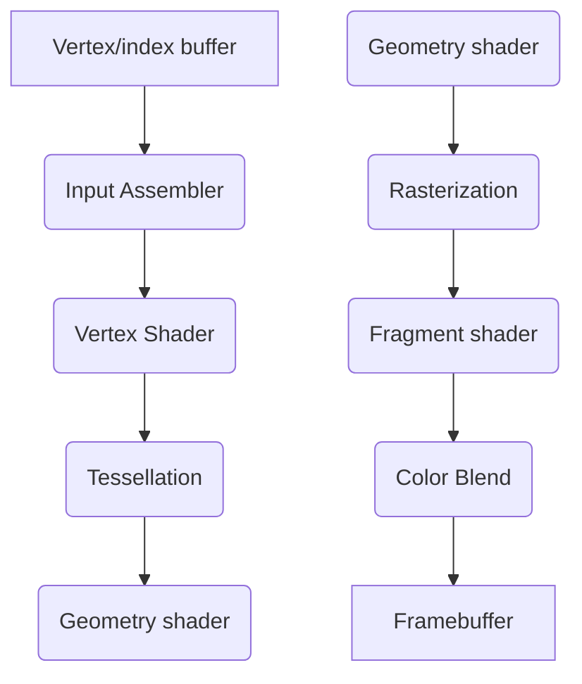

# triangle-in-vulkan
Drawing a triangle by following [Vulkan-tutorial](https://vulkan-tutorial.com/Drawing_a_triangle) 

#### Frameworks used
 -  [Vulkan SDK](https://vulkan.lunarg.com/)
 -  [GLFW binaries](https://www.glfw.org/)
 -  [GLM](https://github.com/g-truc/glm)

#### Graphics Pipeline

